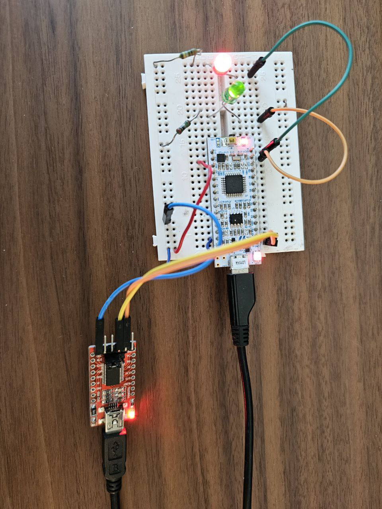

# README

## Description

This project is designed for the STM32 NUCLEO-L011K4 board that uses STM32L011K4T6 MCU. It includes a UART interface for processing specific text commands and controlling LEDs connected to GPIO pins.

## How to build

### Using VS Code Tasks
- Open the project in Visual Studio Code.
- Access the tasks by pressing Ctrl+Shift+P and typing Tasks: Run Task.
- Choose a task to run, such as:
    - Re-build project
    - Clean project
    - Flash project
    - Run CMake configuration

### Using command line:

Run cmake configuration:

`cmake -S . -B build --no-warn-unused-cli -DCMAKE_EXPORT_COMPILE_COMMANDS:BOOL=TRUE -DCMAKE_BUILD_TYPE:STRING=Debug -DCMAKE_TOOLCHAIN_FILE:FILEPATH=gcc-arm-none-eabi.cmake -DUART_BAUD_RATE=115200 -DLED_PIN1=4 -DLED_PIN2=5 -DLED_PIN3=3 -DLED_PIN4=0 -Bbuild -G Ninja`

Build project:

`cmake --build build -v -j8`

Flash project:

`STM32_Programmer_CLI --connect port=swd --download build/mk-test.elf -hardRst`

## Build Options

`UART_BAUD_RATE` : Sets the baud rate for UART communication (default: 115200).

`PIN1`, `PIN2`,`PIN3`, `PIN4`: Define the GPIO pins used for LED control.

## Tools Used
- Visual Studio Code: For development with tasks integration.
- CMake, Ninja: For building the project.
- GNU Arm Embedded Toolchain: Compiler and tools for ARM Cortex-M processors.
- STM32CubeProgrammer: For flashing the firmware to the board.

